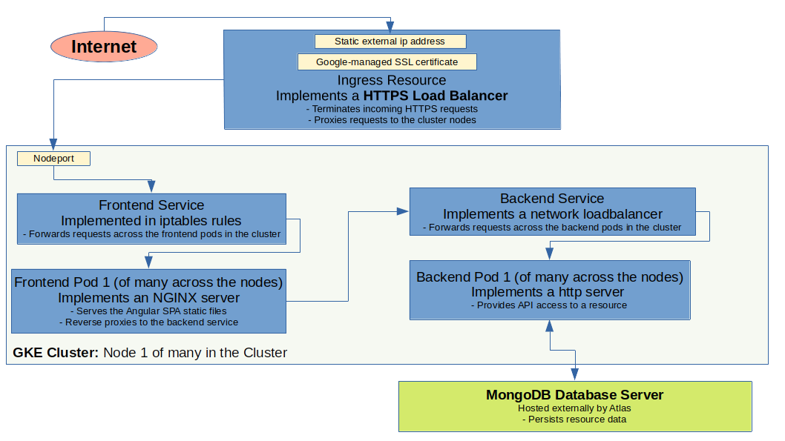

# Proof of Concept web application hosted on Kubernetes

As the second stage of my web application, I refactored from the original monolith design to a microservice-based design. The single page web application is hosted at <https://projectperform.com/> and runs as containerized microservices in a Kubernetes cluster.  An external ingress controller routes incoming https traffic to a frontend microservice that implements an NGINX server serving the static Angular single page content and acting as a reverse proxy to the backend microservice via a loadbalancer.  The backend microservice implements the business logic and communicates with an external database hosted on MongoDB Atlas.  The Kubernetes cluster is managed using Helm. The application was developed using Skaffold which allows you to build, push, and deploy your application from VSCode, with auto rebuild on code change.  The application is deployed on a Google Kubernetes Engine cluster via a Google Cloudbuild CI/CD pipeline that is triggered on a check-in to the Git main branch - all candidate and deployed Helm Charts are checked in to Git to allow for audit and rollback.  The source code is hosted on GitHub at <https://github.com/cname87/project-perform-k8es>.

## Architecture

- HTTPS requests from the internet are addressed to a permanently available static ip address and terminated in the Ingress resource via a Goggle-managed tls certificate.

- The Ingress resource is a GCP HTTPS load balancer which proxies the requests to the Frontend service.  The requests are distributed to the nodes in the cluster via the nodeport on the node.

- The frontend service is an abstaction, mainly implemented in the node iptables rules, which forwards the requests to one of the frontend pods in the cluster.

- The frontend microservice implemented in the frontend pods implements a NGINX server that serves the static application files.  The application files are the result of a build of an Angular single page web application.

- The web application is a sports team management application.  It authenticates users, displays team information and allows team information to be added or updated.  It calls out via an OpenAPI to a backend service to access and update the team member information.

- The backend service implements a clusterIP service forwarding the frontend requests evenly across the backend pods in the cluster.

- The backend microservice implemented in the backend pods provides REST API access to the team member information.  It calls out to a MongoDB datbase server hosted by Atlas to persist the team member information.

## Application Configuration

Refer to the configuration guide [here.](./docs/config-guide.md)

## Development Guide

Refer to the development guide [here.](./docs/development-guide.md)

## Technologies

### Core World Wide Web technologies

- **Javascript**:  Javascript is the programming language underlying Typescript used to write the backend server and client-side application.
- **HTML**: The standard web markup language.
- **CSS**: the language used to describe the style or presentation of a web document.

### Programming Language

- **Typescript**: The backend and frontend were written in Typescript which is a superset of Javascript offering static typing and the latest ECMAScript features.

### Backend Server technologies

- **Node.js**: Node is a runtime built on Chrome’s V8 Javascript engine that provides a framework upon which you can develop server-side applications.
- **NPM**:  npm provides a means for sourcing and managing external packages, and also scripting for building and testing the application.
- **Express.js**: A Node.js web application for developing a HTTP server – provides the ability to easily define routes and request handlers.
- **OpenAPI**: A tool to describe a backend API and then generate server stubs.
- **Mocha**: Mocha provides a unit-test framework.

### Database technology

- **MongoDB**: MongoDB is a NoSQL database suitable for web applications.  The data is hosted by MongoDB Atlas who provide a fully-managed cloud database with security and redundancy.
- **Mongoose**: Mongoose is a Node.js package that provides MongoDB application data modelling, validation and business logic hooks.

### Frontend technology

- **Angular**:  Angular is a framework for developing client-side web applications and provides a means to develop robust extensible applications.
- **Angular Material**: Offers component infrastructure and Material Design components for Angular.
- **Angular/Flex-Layout**: Provides HTML UI layout for Angular applications.
- **Karma/Jasmine**: The font-end unit test framework uses Karma to run the client-side application and Jasmine to provide the test scripting, assertions, and reporting.
- **Protractor**: Protractor is an end-to-end test framework for Angular applications – it runs tests against a real browser and can test staged and deployed builds.

### Development Environment

- **Git**: Git is a distributed version control system – the source code is hosted on GitHub.
- **VSCode**: Visual Studio Code is a streamlined code editor with support for development operations like debugging, task running, and version control.
- **Skaffold**: Skaffold is a command line tool that facilitates continuous development for Kubernetes-native applications.

### Build & Deployment

- **Google Cloud Build**: Cloud Build is a service that executes builds on GCP’s infrastructure producing Docker images for deployment.
- **Docker**: Docker is the underlying container technology used by Cloud Build.
- **Google Cloud Storage**: Cloud Storage is used to host environment variables, certs, keys and other sensitive data not hosted on GitHub.
- **Google Kubernetes Environment**: The application is hosted on a Kubernetes cluster provided by the Google GKE environment.
- **Kubernetes**: Kubernetes is an open-source system for automating deployment, scaling, and management of containerized applications
- **Helm**: Helm packages Kubernetes application configuration to help define, install, and upgrade the application.
